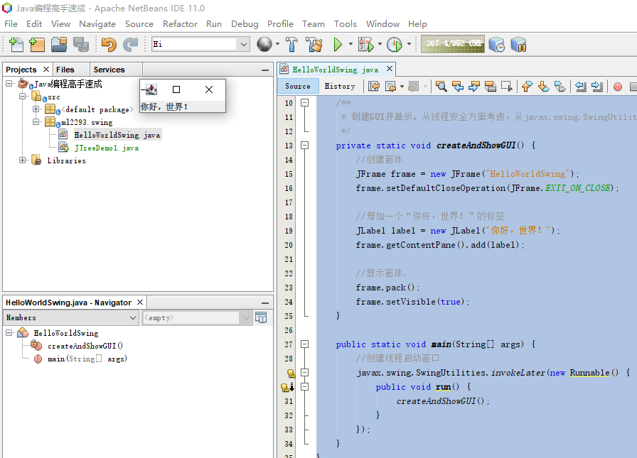
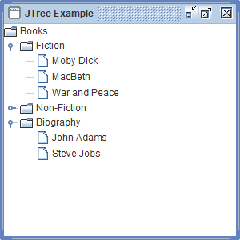

# Java编程高手速成
Cody Luo @2019 summer

[TOC]

## 基础
### JDK的安装与切换
JDK(Java Development Kit)，Java开发包是Java平台的标准实现，包括标准版(Standard Edition),企业版(Enterprise Edition)和微型版(Micro Edition)，现在由Oracle公司负责升级与发布。2009年4月Oracle公司收购SUN公司。Java是跨平台的编程语言，适用的操作系统包括Solaris, Linux, macOS, Windows等等。

安装JDK有两种选择：
- Oracle JDK, https://www.oracle.com/technetwork/java/javase/downloads/index.html , 目前的版本是12
- OpenJDK, https://jdk.java.net/ , 开源，目前的版本是12

两种JDK各分有64位和32位的安装包，建议选择64位的，Oracle JDK和OpenJDK都安装，使用时只需简单修改系统环境变量JAVA_HOME的值即可完成两种JDK的切换。
在Windows开发环境下，可以把 jdk-12.0.1_windows-x64_bin.exe 安装到 D:\Java\jdk
接着把 openjdk-12.0.1_windows-x64_bin.zip 解压到 D:\Java\openjdk
现在设置环境变量，以管理员身份运行cmd，运行
```
    set JAVA_HOME=D:\Java\openjdk
    set PATH=%JAVA_HOME%\bin;%PATH% 
```
也可右键我的电脑（或者在控制面板中点击系统）->属性->高级->环境变量，在系统变量中新建变量名JAVA_HOME，变量值为JDK的安装路径。例：JAVA_HOME=D:\Java\openjdk
在PATH中添加一条%JAVA_HOME%\bin
建议不要设置CLASSPATH这样的一个环境变量，因为一般情况下不需要指定类路径，需要时完全可以在java运行命令行中用-cp参数指定

现在，JDK安装完成了，另起一个CMD或者PowerShell窗口,
```
C:\Users\ljl>java -version
openjdk version "12.0.1" 2019-04-16
OpenJDK Runtime Environment (build 12.0.1+12)
OpenJDK 64-Bit Server VM (build 12.0.1+12, mixed mode, sharing)

C:\Users\ljl>java Hi.java  # 新的Java 11特性: 直接运行单个.java源程序
Hello, World！你好，世界！

C:\Users\ljl>javac Hi.java

C:\Users\ljl>java Hi
Hello, World！你好，世界！

```

其中Hi.java 的内容如下，可用快速的编辑器进行编辑，如Notepad，Editplus，Visual Studio Code…… 为了防止中文出现乱码，注意在Windows CMD、PowerShell中运行时，Hi.java的编码应为ANSI(实际上是GBK)；而在IDE及云平台中运行的.java源码一般应为UTF-8编码格式！
```
public class Hi {
    public static void main(String[] args) {
        // Prints some string to the terminal window.
        System.out.println("Hello, World！你好，世界！");
    }
}
```

当需要使用Oracle JDK时，只需切换环境变量 `set JAVA_HOME=D:\Java\jdk` ，再重启命令行窗口，
```
C:\Users\ljl>java -version
java version "12.0.1" 2019-04-16
Java(TM) SE Runtime Environment (build 12.0.1+12)
Java HotSpot(TM) 64-Bit Server VM (build 12.0.1+12, mixed mode, sharing)
```
而在IDE中，完全可以指定使用哪个路径下的JDK进行编译和开发。

在Linux, UNIX, Solaris, FreeBSD系统中，安装相应的JDK后，使用export设置环境变量， env 查看所有环境变量
```
$ su root
$ export JAVA_HOME=/path/to/java
$ export PATH = /path/to/java:$PATH
$ env
$ java -version
```

为了点燃你对Java的热情，建议你现在翻看本书的

- 
-

### 下载或者翻看openjdk的源码库
openjdk正在开发中的的源码库在 http://hg.openjdk.java.net/jdk/jdk/ 可以在线浏览，网页的左边导航中有 .bz2 .gz .zip 三种压缩文件可供下载，其中以bz2的压缩率最高。  
http://hg.openjdk.java.net/jdk/jdk/archive/tip.tar.bz2

### Java语言的特征
Java宣传的口号是
> Write Once, Run Anywhere
> 一次编写，到处运行

James Gosling，Java语言的创始人，在1995年发布了Java的第一个版本，后来和Henry McGilton在发表的白皮书《Java语言环境》，其中使用这些时髦术语描述Java的特性：
> - 简单  Simple
> - 面向对象  Object oriented
> - 分布式  Distributed
> - 多线程  Multithreaded
> - 动态  Dynamic
> - 建筑中性  Architecture neutral
> - 便携式的  Portable
> - 高性能  High performance
> - 健壮  Robust
> - 安全  Secure

Java平台包括两个部分：
- Java虚拟机(JVM, Java Virtual Machine)
- Java应用编程接口(Java API, Java Application Programming Interface)

### 关键字

abstract 抽象    assert 断言 	boolean 布尔 	break 断开
byte 字节	case 用例	catch 捕获 	char 字符
class 类 	const 常量 	continue 继续	default 缺省
do 做 	double 双倍小数 	else 否则 	enum 枚举
extends 扩展	final 最终的 	finally 最后 	float 浮点数
for 为	goto 跳到 	if 如果 	implements 实现
import 导入 	instanceof 属于实例	int 整数	interface 接口
long 长整型	native 本地的	new 新建	package 包
private 私有的	protected 保护的	public 公共的 	return 返回
short 短整型	static 静态的 	strictfp 严格浮点	super 父类的
switch 开关 	synchronized 同步的	   this 当前类的	throw 抛出
throws 抛出	   transient 短暂的 	try 尝试	void 空缺
volatile 易变的 	while 每当

除了这些关键字外，还有三个经常用到的字面量:true false null

### 注释
/*
block comments 块注释
*/

// line comment 行注释

### 数据类型

共有8种原生类型在Java语言中。另外，void表示空缺，或表示函数无返回值，不在8种原生类型之列。null表示某个变量为空值。

|包装器类型|数据类型|大小|描述|缺省值|数值样例|
|--- |--- |--- |--- |--- |--- |
| Byte |byte|1 byte|  -128 ~ 127 byte[]类型数组经常用于存放内存数据 | 0 | 20, 0xFF, 0b10110101 |
| Short |short|2 bytes| -32,768 ~ 32,767| 0 | 32767 |
| Integer |int|4 bytes| -2,147,483,648 ~ 2,147,483,647| 0 | -1 |
| Long |long|8 bytes| -9,223,372,036,854,775,808 ~ 9,223,372,036,854,775,807| 0L | 234_1234L |
| Float |float|4 bytes| 1.4E-45 ~ 3.4E38| 0.0f | 2.4e+12 |
| Double |double|8 bytes|4.9E-324 ~ 1.7976931348623157E308 有效存储15个10进制数字| 0.0d | -768.25D , 1.2e+38d, Double.NaN, Double.POSITIVE_INFINITY |
| Boolean |boolean|1 bit| true 或 false | false | true, false |
| Character |char|2 bytes| 单个ASCII字符 | '\u0000' | 'A' , 65 , '\n'|
| Void | void | 0 | 空缺 |  | |


### 流程控制

### 运算符优先级

<pre>
    优先级   操作符   含义        关联性  用法 
    -------------------------------------------------------
    1        [ ]      数组下标      左    array_name[expr] 
             .        成员选择      左    object.member 
             ( )      方法参数      左    method_name(expr_list) 
             ( )      实例构造      左    class_name(expr_list) 
             ++       后缀自增      左    lvalue++ 
             --       后缀自减      左    lvalue-- 
     
    2        ++       前缀自增      右    ++rvalue 
             --       前缀自减      右    --lvalue 
             ~        按位取反      右    ~expr 
             !        逻辑非        右    !expr 
             +        一元加        右    +expr 
             -        一元减        右    -expr 
     
    3        ( )      强制转换      右    (type)expr 
             new      对象实例化    右    new type() 
                                          new type(expr_list) 
                                          new type[expr] 
     
    4        *        乘            左    expr * expr 
             /        除            左    expr / expr 
             %        求余          左    expr % expr 
     
    5        +        加            左    expr + expr 
             -        减            左    expr - expr 
             +        字符串连接    左    strExpr + strExpr 
     
    6        >>       有符号右移    左    expr >> distance 
             >>>      无符号右移    左    expr >>> distance 
     
    7        <        小于          左    expr < expr 
             <=       小于等于      左    expr <= expr 
             >        大于          左    expr > expr 
             >=       大于等于      左    expr >= expr 
          instanceof  类型比较      左    ref instanceof refType 
             ==       等于          左    expr == expr 
             !=       不等于        左    expr != expr 
     
    8        &        整数按位与    左    integralExpr & integralExpr 
             &        布尔与        左    booleanExpr & booleanExpr 
     
    9        ^        整数按位异或  左    integralExpr ^ integralExpr 
             ^        布尔异或      左    booleanExpr ^ booleanExpr 
     
    10       |        整数按位或    左    integralExpr | integralExpr 
             |        布尔或        左    booleanExpr | booleanExpr 
     
    11       &&       逻辑与        左    booleanExpr && booleanExpr 
     
    12       ||       逻辑或        左    booleanExpr || booleanExpr 
     
    13       ? :      条件运算      右    booleanExpr ? expr : expr 
     
    14       =        赋值          右    lvalue = expr 
             *=       乘赋值        右    lvalue *= expr 
             /=       除赋值        右    lvalue /= expr 
             %=       模赋值        右    lvalue %= expr 
             +=       加赋值        右    lvalue += expr 
             +=    字符串连接赋值   右    lvalue += expr 
             -=       减赋值        右    lvalue -= expr 
             <<=      左移赋值      右    lvalue <<= expr 
             >>=   有符号右移赋值   右    lvalue >>= expr 
             >>>=  无符号右移赋值   右    lvalue >>>= expr 
             &=    整数按位与赋值   右    lvalue &= expr 
             &=       布尔与赋值    右    lvalue &= expr 
             |=    整数按位或赋值   右    lvalue |= expr 
             |=       布尔或赋值    右    lvalue |= expr 
             ^=   整数按位异或赋值  右    lvalue ^= expr 
             ^=     布尔异或赋值    右    lvalue ^= expr 
</pre>

运算符不但有优先级，还有关联性。
上表中关联性为“左”表示该表达式从左边开始进行运算；关联性为“右”表示该表达式从右边开始进行运算。  
下面几条左右等价的代码可以让你快速记忆Java运算符的优先级:
<pre>
a[0].toString()           (a[0]).toString()

a += c|b+3>>4^0xF5 &1    a+= (c| (( ((b+3)>>4) ^0xF5) &1) )

int i=0,j=10,n=i+++j;    int i=0,j=10,n=(i++)+j;  
//运行后i:1,j:10,n:10  


</pre>


### 类修饰词的作用域

### jshell

### java.exe

java -h
 -splash:<图像路径>

## String
### 计算某年某月某日是星期几
 source: DayOfWeek .java
 ```
 package ml2293.basic;

/*
 *  读入年月日，输出星期几
 *  月份m=1 表示1月 January
 *  输出 0 表示星期天 Sunday， 1 表示星期一 Monday， 等等.
 *  计算公式为:
 *        y0 = y - (14 - m) / 12
 *        x = y0 + y0/4 - y0/100 + y0/400
 *        m0 = m + 12 * ((14 - m) / 12) - 2
 *        dayOfWeek = (d + x + (31*m0)/12) mod 7
 *
 *  % java ml2293.basic.DayOfWeek 1949 10 1 
 *  6                              // 星期六 Saturday
 *
 *  % java ml2293.basic.DayOfWeek 2000 1 2   #January 2, 2000
 *  0                              // 星期天 Sunday
 *
 ******************************************************************************/
public class DayOfWeek {

    public static void main(String[] args) {
        int y = Integer.parseInt(args[0]);
        int m = Integer.parseInt(args[1]);
        int d = Integer.parseInt(args[2]);

        int y0 = y - (14 - m) / 12;
        int x = y0 + y0 / 4 - y0 / 100 + y0 / 400;
        int m0 = m + 12 * ((14 - m) / 12) - 2;
        int d0 = (d + x + (31 * m0) / 12) % 7;

        System.out.println(d0);
    }
}
```

## ava.util.function
### Comsumer

source: ComsumerDemo.java
```
package ml2293.basic;

import java.util.function.Consumer;
public class ComsumerDemo {
    public static void main(String args[]) 
    { 
        // Consumer to display a number 
        Consumer<Integer> display = a -> System.out.println(a);
        Consumer<Integer> displaySquare = a -> System.out.println(a*a);
        // invoke display using accept() 
        display.accept(10);
        //andThen 表示了依次调用的顺序
        display.andThen(displaySquare).accept(9); 
    }
}
```

运行结果: $ java ComsumerDemo  
10
9
81

## Swing
JFC(Java Foundation Classes)是Java基础类的简称，它概括了使用Swing构建GUI界面的各个方面，主要包括：

| 功能 | 描述 |
|--|--|
| Swing GUI 组件 | 包括从按钮到分割线到数据表等等的各种组件，其中许多都支持排序、打印、拖放…… |
| 可插拔的外观(Look-and-Feel)支持 |  |
| 内容可达(Accessibility) API | 启用辅助技术，如屏幕阅读器和盲文显示器，以从用户界面获取信息 |
| Java 2D API | 支持高质量的2D图形、文字、图片显示，还支持发送2D数据到打印设备 |
| 国际化 | 创建可切换的多国语言支持界面 |


Swing API 是强大的，灵活的，庞大的，有18个公共包:
> javax.accessibility 	javax.swing.plaf 	javax.swing.text
javax.swing 	javax.swing.plaf.basic 	javax.swing.text.html
javax.swing.border 	javax.swing.plaf.metal 	javax.swing.text.html.parser
javax.swing.colorchooser 	javax.swing.plaf.multi 	javax.swing.text.rtf
javax.swing.event 	javax.swing.plaf.synth 	javax.swing.tree
javax.swing.filechooser 	javax.swing.table 	javax.swing.undo

主要代码集中在javax.swing 和 javax.swing.event 两个包中。

进行Swing和Java FX 界面编程时，强烈推荐使用NetBeans。

### 一个简单的swing窗体程序
source: HelloWorldSwing.java
```
package ml2293.swing;

/*
 * 一个简单的swing窗体程序
 */
import javax.swing.*;

public class HelloWorldSwing {

    /**
     * 创建GUI并显示。从线程安全方面考虑，从javax.swing.SwingUtilities.invokeLater中创建线程启动窗口。
     */
    private static void createAndShowGUI() {
        //创建窗体
        JFrame frame = new JFrame("HelloWorldSwing");
        frame.setDefaultCloseOperation(JFrame.EXIT_ON_CLOSE);

        //增加一个“你好，世界！”的标签
        JLabel label = new JLabel("你好，世界！");
        frame.getContentPane().add(label);

        //显示窗体.
        frame.pack();
        frame.setVisible(true);
    }

    public static void main(String[] args) {
        //创建线程启动窗口
        javax.swing.SwingUtilities.invokeLater(new Runnable() {
            public void run() {
                createAndShowGUI();
            }
        });
    }
}
```

运行结果: $ java HelloWorldSwing



### JTree
下面的程序显示了用JTree显示树形多层次的数据

source: JTreeDemo1.java
```
package ml2293.swing;

import javax.swing.*;
import javax.swing.tree.*;
 
public class JTreeDemo1 {
 
  public static void main(String[] arguments) {
 
    JFrame.setDefaultLookAndFeelDecorated(true);
    JFrame frame = new JFrame("JTree Example");
    frame.setSize(300,300);
    frame.setDefaultCloseOperation(JFrame.EXIT_ON_CLOSE);
 
 
    DefaultMutableTreeNode books = new DefaultMutableTreeNode("Books");
 
    // Three Departments
    DefaultMutableTreeNode fiction = new DefaultMutableTreeNode("Fiction");
    DefaultMutableTreeNode nonfiction = new DefaultMutableTreeNode("Non-Fiction");
    DefaultMutableTreeNode biography = new DefaultMutableTreeNode("Biography");
 
 
    // Fiction Books
    fiction.add(new DefaultMutableTreeNode("Moby Dick"));
    fiction.add(new DefaultMutableTreeNode("MacBeth"));
    fiction.add(new DefaultMutableTreeNode("War and Peace"));
 
 
    // Non Fiction Books
    nonfiction.add(new DefaultMutableTreeNode("Unbroken"));
    nonfiction.add(new DefaultMutableTreeNode("The Diary of a Young Girl"));
    nonfiction.add(new DefaultMutableTreeNode("The Prince"));
 
    // Biography Books
    biography.add(new DefaultMutableTreeNode("John Adams"));
    biography.add(new DefaultMutableTreeNode("Steve Jobs"));
 
    books.add(fiction);
    books.add(nonfiction);
    books.add(biography);
 
    JTree tree = new JTree(books);
    frame.add(tree);
 
    frame.setVisible(true);
 
  }
}
```

运行结果：
$ java JTreeDemo1



## 网络
### 端口扫描 PortScanner
socket连接一个地址端口时，若目标端口未开放，则会抛出一个java.net.SocketTimeoutException。其中的1000表示连接超时时长设为1秒。利用这个原理就可以设计出下面这个极简单的端口扫描程序。

source: PortScanner.java
```
package ml2293.network;
import java.net.*;
public class PortScanner {
    public static void main(String[] args) {
        for (int port = 1; port <= 9999; port++) {
            try (Socket socket = new Socket()) {
                socket.connect(new InetSocketAddress("202.38.64.3", port), 1000);
                System.out.println(port + " is open");
            } catch (Exception ex) {
            }
        }
    }
}
```

运行结果：
<pre>
$ java ml2293.network.PortScanner
23 is open
80 is open
443 is open
</pre>

思考与练习：
1. 设计一个Swing界面的端口扫描程序，放到云虚拟机中日夜运行。其中有两个列表JList hosts; JList ports; 


### SimpleHttpServer
这个简单的HttpServer使用了Sun官方制定的package com.sun.net.httpserver，功能简单，且掩盖了HTTP协议的细节，但清晰的体现了一个请求上下文对应一个HttpHandler的web设计思想。

source: SimpleSunHTTPServer.java
```
package ml2293.http;

import java.io.*;
import java.net.*;
import com.sun.net.httpserver.*;
 
public class SimpleSunHTTPServer {
 
   public static void main(String[] args) throws Exception {
      HttpServer server = HttpServer.create(new InetSocketAddress(8080), 0);
      server.createContext("/hello", new HelloHandler());
      server.setExecutor(null);
      server.start();
      System.out.println("Http服务正在运行监听端口8080" );
      System.out.println("http://localhost:8080/hello" );
   }
 
   static class HelloHandler implements HttpHandler {
      @Override
      public void handle(HttpExchange t) throws IOException {
         String response = "Hello from SimpleSunHTTPServer.....";
         t.sendResponseHeaders(200, response.length());
         OutputStream os = t.getResponseBody();
         os.write(response.getBytes());
         os.close();
      }
   }
}
```

### 获取某台主机的IP地址
source: FindIPAddress.java
```
package ml2293.network;
import java.net.*;
public class FindIPAddress {
    public static void main(String[] args) {
        String hostname = "www.google.com";
        try {
            InetAddress ipaddress = InetAddress.getByName(hostname);
            System.out.println("IP address: " + ipaddress.getHostAddress());
        } catch (UnknownHostException e) {
            System.out.println("UnknownHostException when try to find address for: " + hostname);
        }
    }
}
```

运行结果：
<pre>
$ java FindIPAddress
IP address: 69.171.242.11
</pre>

### 获取主机的所有IP地址
source: GetAllIpAddresses.java
```
package ml2293.network;

import java.net.InetAddress;
import java.net.UnknownHostException;
 
public class GetAllIpAddresses {
   public static void main(String a[]){
      try {
         InetAddress[] myHost = InetAddress.getAllByName("www.baidu.com");
         for(InetAddress host:myHost){
            System.out.println(host.getHostAddress());
         }
      } catch (UnknownHostException ex) {
         ex.printStackTrace();
      }
   }
}
```

运行结果：
<pre>
$ java GetAllIpAddresses
183.232.231.172
183.232.231.174
</pre>

### 获取MAC地址
source: MacAddress.java
```
package ml2293.network;

import java.net.*;

public class MacAddress {

    public static void main(String[] args) {

        InetAddress ip;
        try {
            ip = InetAddress.getLocalHost();
            System.out.println("IP address : " + ip.getHostAddress());
            NetworkInterface network = NetworkInterface.getByInetAddress(ip);
            byte[] mac = network.getHardwareAddress();
            System.out.print("MAC address : ");

            StringBuilder sb = new StringBuilder();
            for (int i = 0; i < mac.length; i++) {
                sb.append(String.format("%02X%s", mac[i], (i < mac.length - 1) ? "-" : ""));
            }
            System.out.println(sb.toString());

        } catch (Exception e) {
            e.printStackTrace();
        }
    }
}

```

运行结果：
<pre>
$ java MacAddress
IP address : 192.168.0.102
MAC address : 00-26-15-16-C3-24
</pre>

### Socket编程构建HttpServer


## 数学与BigInteger

### 梅森质数与Lucas-Lehmer测试
首先，梅森数(Mersenne number) M=2^p-1 是质数，则p必须是质数；当p是一个质数，M=2^p-1 的因子数q总是形如 q=2*k*p+1 ， 并且 q%8=±1

Lucas-Lehmer Test: 对于任意奇质数p， 梅森数 M=2^p-1 是质数当且仅当s[p-2] % M==0，这里 s[n]:=(s[n-1])^2 - 2, s[0]=4

目前发现的最大的梅森质数是2^82,589,933-1

source: MersenneNumber.java
```
package ml2293.math;

import java.math.BigInteger;

public class MersenneNumber {

    public static boolean isPrime(int p) {
        if (p == 2) {
            return true;
        } else if (p <= 1 || p % 2 == 0) {
            return false;
        } else {
            int to = (int) Math.sqrt(p);
            for (int i = 3; i <= to; i += 2) {
                if (p % i == 0) {
                    return false;
                }
            }
            return true;
        }
    }

    public static boolean isMersennePrime(int p) {
        if (p == 2) {
            return true;
        } else {
            BigInteger m_p = BigInteger.ONE.shiftLeft(p).subtract(BigInteger.ONE);
            BigInteger s = BigInteger.valueOf(4);
            for (int i = 3; i <= p; i++) {
                s = s.multiply(s).subtract(BigInteger.valueOf(2)).mod(m_p);
            }
            return s.equals(BigInteger.ZERO);
        }
    }

    public static void main(String[] args) {       
        if (args.length > 0) {
            int p = Integer.parseInt(args[0]);
            if (isPrime(p) && isMersennePrime(p)) {
                System.out.print(" M" + p + " is prime!");
            } else {
                System.out.print(" 2^" + p + "-1 is composite.");
            }
        } else {
            int upb = 5000;
            System.out.print(" M[2.." + upb + "] 中找到的梅森质数有:\nM2 ");
            for (int p = 3; p <= upb; p += 2) {
                if (isPrime(p) && isMersennePrime(p)) {
                    System.out.print(" M" + p);
                }
            }
        }
    }
}
```

运行结果：
<pre>
NetBeans中按下Shift+F6运行文件MersenneNumber.java，输出：

 M[2..5000] 中找到的梅森质数有:
M2  M3 M5 M7 M13 M17 M19 M31 M61 M89 M107 M127 M521 M607 M1279 M2203 M2281 M3217 M4253 M4423
BUILD SUCCESSFUL (total time: 1 minute 27 seconds)

$ java ml2293.math.MersenneNumber 44497
 M44497 is prime!
</pre>


## Java中最常见的类System
### System.currentTimeMillis()

## 几个优秀的Java开源项目

### ImageJ
### H2 database
### crawler4J
### SparkJava
### jEdit


## 附录
### 参考资料
- JDK 12 Documentation, https://docs.oracle.com/en/java/javase/12/index.html
- The Java™ Tutorials, https://docs.oracle.com/javase/tutorial/
- Introduction to Programming in Java, https://introcs.cs.princeton.edu/java/home/
- Java Examples, https://www.javacodex.com/