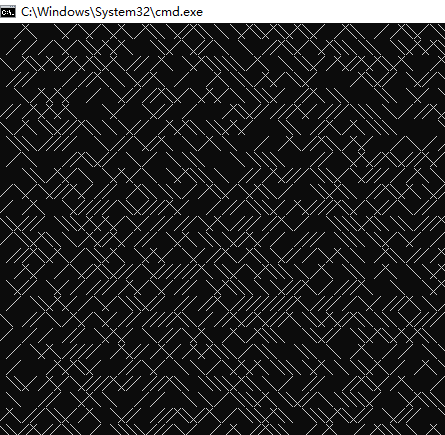

# Python编程进阶
@ 2018冬季 Cody Luo (罗江林 cody@ ustc.edu)

### 使用*pickle*序列化对象
pickle提供了一种对象序列化的机制，一个对象可以被表示为一个字节序列。 将序列化对象写入文件之后，可以从文件中读取出来，并且对它进行反序列化
 
- pickle.dump(obj, file, protocol=None, *, fix_imports=True)
- pickle.dumps(obj, protocol=None, *, fix_imports=True)
- pickle.load(file, *, fix_imports=True, encoding="ASCII", errors="strict")
- pickle.loads(bytes_object, *, fix_imports=True, encoding="ASCII", errors="strict")


```python
import pickle

obj={'book':'python计算机视觉编程','author':'Jan Solem','url':'http://shop.oreilly.com/product/0636920022923.do'}
with  open('book.obj', 'bw') as file:
    pickle.dump(obj, file)    
```

```python
import pickle

with open('book.obj', 'rb') as f:
    data = pickle.load(f)
    print(data)
```

### GUI: tkinter

```python=
from tkinter import *
Label(text='Spam').pack()
mainloop()
```

https://docs.python.org/3/library/tkinter.html

### urlopen

```python=
import urllib.request
with urllib.request.urlopen('http://qing.tk/webbud/') as f:
    print(f.read(300))
```

### ftplib
```
>>> from ftplib import FTP
>>> ftp = FTP('ftp.auckland.ac.nz')
>>> ftp.login()
'230 Login successful.'
>>> ftp.dir()
lrwxrwxrwx    1 0        0              18 Mar 05  2010 debian -> linux/dists/debian
drwxr-x---    3 30016    30016       20480 Aug 05  2010 ironport
drwxr-xr-x    3 0        0            4096 Mar 05  2006 linux
drwxr-xr-x    2 0        0           16384 Jan 11  2007 lost+found
dr-xr-xr-x   20 0        0            4096 Jun 13  2010 pub
>>> ftp.cwd('/pub/gnu/wget')
'250 Directory successfully changed.'
>>> ftp.retrbinary('RETR wget-1.19.tar.xz', open('wget-1.19.tar.xz', 'wb').write)
'226 File send OK.'
>>> ftp.quit()
'221 Goodbye.'
```

## Python精湛代码
### 简单web服务器, 以当前目录开始
```
 # Python 2
python -m SimpleHTTPServer

 # Python 3
python -m http.server 80
```

### 心形字符图案
```
print('\n'.join([''.join([('EternalLove!'[(x-y)%8]if((x*0.05)**2+(y*0.1)**2-1)**3-(x*0.05)**2*(y*0.1)**3<=0 else' ')for x in range(-30,30)])for y in range(15,-15,-1)]))
```

 

### Mandelbrot集
```
print('\n'.join([''.join(['*'if abs((lambda a:lambda z,c,n:a(a,z,c,n))(lambda s,z,c,n:z if n==0else s(s,z*z+c,c,n-1))(0,0.02*x+0.05j*y,40))<2 else' 'for x in range(-80,20)])for y in range(-20,20)]))
```


### 乘法表
```
  #命令行中打印9X9乘法表
py -c "print( '\n'.join([' '.join(['%s*%s=%-2s' % (y,x,x*y) for y in range(1,x+1)]) for x in range(1,10)]))"

  ##打印16进制乘法表
print( '\n'.join([' '.join(['%s*%s=%-2s' % (hex(y)[2:],hex(x)[2:],hex(x*y)[2:]) for y in range(1,x+1)]) for x in range(1,0x10)]))

```

### 质数序列
```
pl=[i for i in range(2, 1000) if all(tuple(i%j for j in range(2, int(i**.5)+1)))]
print(pl)
  # [2, 3, 5, 7, 11, 13, 17, 19, 23, 29, 31, 37, 41, 43, 47, 53, 59, 61, 67, 71, 73, 79, 83, 89, 97, 101, 103, 107, 109, 113, 127, 131, 137, 139, 149, 151, 157, 163, 167, 173, 179, 181, 191, 193, 197, 199, 211, 223, 227, 229, 233, 239, 241, 251, 257, 263, 269, 271, 277, 281, 283, 293, 307, 311, 313, 317, 331, 337, 347, 349, 353, 359, 367, 373, 379, 383, 389, 397, 401, 409, 419, 421, 431, 433, 439, 443, 449, 457, 461, 463, 467, 479, 487, 491, 499, 503, 509, 521, 523, 541, 547, 557, 563, 569, 571, 577, 587, 593, 599, 601, 607, 613, 617, 619, 631, 641, 643, 647, 653, 659, 661, 673, 677, 683, 691, 701, 709, 719, 727, 733, 739, 743, 751, 757, 761, 769, 773, 787, 797, 809, 811, 821, 823, 827, 829, 839, 853, 857, 859, 863, 877, 881, 883, 887, 907, 911, 919, 929, 937, 941, 947, 953, 967, 971, 977, 983, 991, 997]

  # 注意：如果range(2, int(i**.5)+1)换成range(2, int(i**.5)) ，那么质数的平方也会包含其中，但合数的平方不在其中
```

### 计算输入数字的阶乘
```
import functools
f=functools.reduce(lambda x,y:x*y,  range(1,int(input('输入整数n:'))+1))
print('n!=',f)
```

### random.choice
```
import random;print (random.choice([1,2,5,10]))
# 这两句代码也可写成这样：
print(__import__('random').choice([1, 2, 5, 10]))
```

### 打印八皇后问题的92个解
```
import sys,itertools;[sys.stdout.write('\n'.join('.' * i + 'Q' + '.' * (8-i-1) for i in vec) + "\n========\n") for vec in itertools.permutations(range(8)) if 8 == len(set(vec[i]+i for i in range(8))) == len(set(vec[i]-i for i in range(8)))]

```


### 
`import this` 将打印Python之禅 (The Zen of Python, by Tim Peters)

`import antigravity` 将打开浏览器访问网址 https://xkcd.com/

### 获取公网IP地址
```
import socket; sock=socket.create_connection(('ns1.dnspod.net',6666)); print (sock.recv(16)); sock.close()
```

### 打印字符型曲线
```
D:\Python37\Doc>python -c "import math as m;a,v=eval(input());[print('%03d'%x+' '*m.floor(0.5+x*m.tan(a)-x*x/(v*m.cos(a)))+'o') for x in range(102)]"
0.98,100
```


### 随机生成迷宫
```
import random
while 1:
    print(random.choice('╱ ╲'), end='')
```



## Python简明代码样例

### 交换值 x,y=y,x

```python=
x,y=1,2
x,y=y,x
print(x,y)
// 输出 2 1
```

### 字符串
```
name = 'George'
name[::-1]  #返回 'egroeG'。反转字符串 reverse a str。
```
### split 与 join

- str.split(sep=None, maxsplit=-1)
- str.splitlines([keepends])
- str.join(iterable)

```python=
sentence1='My name is <b>Cody Luo</b>!'
s=sentence1.split(None,maxsplit=3)
 # ['My', 'name', 'is', '<b>Cody Luo</b>!']

'+'.join(s)
 # 'My+name+is+<b>Cody Luo</b>!'
```

### 关于列表
```
[0]*3  # [0,0,0]
[1,2,3]+[10]  # [1, 2, 3, 10]

print(list( map(lambda x:x*x, [1,2,3,4]) ))
 # [1, 4, 9, 16]

```

### 合并词典
```python=
x={'a':1,'b':2}
y={'b':'boat','c':3}
z={**x,**y}
print(z)
   # {'a': 1, 'b': 'boat', 'c': 3}
```
### itertools